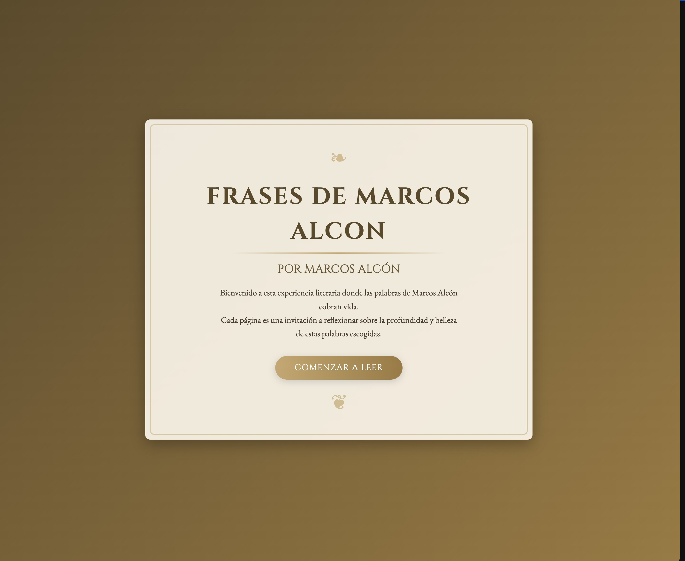

# MarcosGoWeb

<div align="center">
  
</div>

## 🌐 English | [Español](#español)

## Overview

MarcosGoWeb is an elegant web application built with Go that displays a collection of phrases and poems by Marcos Alcón. The application presents the content in a beautiful, interactive book format with page-turning animations, creating an immersive reading experience.

### Features

- Interactive book interface with realistic page-turning effects
- Responsive design that works on various devices
- Beautiful typography and vintage book styling
- API endpoint to access the phrases data
- Multiple viewing modes (single page and book format)

### Technology Stack

- **Backend**: Go (Golang)
- **Frontend**: HTML, CSS, JavaScript
- **Libraries**: StPageFlip for page-turning effects
- **Icons**: Font Awesome

## Project Structure

```
marcosgoweb/
├── main.go                 # Main application entry point
├── go.mod                  # Go module definition
├── install_certbot.sh      # Script for SSL certificate installation
├── static/                 # Static assets
│   ├── css/                # Stylesheet files
│   │   ├── style.css       # Main stylesheet
│   │   ├── book.css        # Book-specific styles
│   │   └── booklet.css     # Booklet format styles
│   ├── js/                 # JavaScript files
│   │   └── book.js         # Book interaction functionality
│   └── data/               # Application data
│       └── poems.json      # Collection of phrases/poems
├── templates/              # HTML templates
│   ├── index.html          # Main page template
│   ├── book.html           # Book view template
│   └── book_single_page.html # Single page view template
└── server/                 # Server-related files
```

## Installation and Setup

### Prerequisites

- Go 1.16 or higher
- A modern web browser

### Steps

1. Clone the repository:
   ```bash
   git clone https://github.com/jaivial/frasesmarcosalcon.git
   cd marcosgoweb
   ```

2. Run the application:
   ```bash
   go run main.go
   ```

3. Open your browser and navigate to:
   ```
   http://localhost:8080
   ```

## API Endpoints

- `GET /` - Main page with interactive book
- `GET /book` - Single page book view
- `GET /api/phrases` - JSON API for all phrases

## Deployment

For HTTPS support, you can use the included certbot installation script:

```bash
chmod +x install_certbot.sh
./install_certbot.sh
```

## License

[MIT License](LICENSE)

---

<a name="español"></a>
# MarcosGoWeb

<div align="center">
  
</div>

## 🌐 [English](#marcosgoweb) | Español

## Descripción General

MarcosGoWeb es una elegante aplicación web construida con Go que muestra una colección de frases y poemas de Marcos Alcón. La aplicación presenta el contenido en un hermoso formato de libro interactivo con animaciones de paso de página, creando una experiencia de lectura inmersiva.

### Características

- Interfaz de libro interactiva con efectos realistas de paso de página
- Diseño responsivo que funciona en varios dispositivos
- Hermosa tipografía y estilo de libro vintage
- Punto de acceso API para acceder a los datos de las frases
- Múltiples modos de visualización (página única y formato de libro)

### Stack Tecnológico

- **Backend**: Go (Golang)
- **Frontend**: HTML, CSS, JavaScript
- **Bibliotecas**: StPageFlip para efectos de paso de página
- **Iconos**: Font Awesome

## Estructura del Proyecto

```
marcosgoweb/
├── main.go                 # Punto de entrada principal de la aplicación
├── go.mod                  # Definición del módulo Go
├── install_certbot.sh      # Script para la instalación de certificados SSL
├── static/                 # Activos estáticos
│   ├── css/                # Archivos de hoja de estilo
│   │   ├── style.css       # Hoja de estilo principal
│   │   ├── book.css        # Estilos específicos para el libro
│   │   └── booklet.css     # Estilos para el formato de folleto
│   ├── js/                 # Archivos JavaScript
│   │   └── book.js         # Funcionalidad de interacción del libro
│   └── data/               # Datos de la aplicación
│       └── poems.json      # Colección de frases/poemas
├── templates/              # Plantillas HTML
│   ├── index.html          # Plantilla de página principal
│   ├── book.html           # Plantilla de vista de libro
│   └── book_single_page.html # Plantilla de vista de página única
└── server/                 # Archivos relacionados con el servidor
```

## Instalación y Configuración

### Requisitos Previos

- Go 1.16 o superior
- Un navegador web moderno

### Pasos

1. Clonar el repositorio:
   ```bash
   git clone https://github.com/tunombredeusuario/marcosgoweb.git
   cd marcosgoweb
   ```

2. Ejecutar la aplicación:
   ```bash
   go run main.go
   ```

3. Abrir el navegador y navegar a:
   ```
   http://localhost:8080
   ```

## Endpoints de la API

- `GET /` - Página principal con libro interactivo
- `GET /book` - Vista de libro en página única
- `GET /api/phrases` - API JSON para todas las frases

## Despliegue

Para soporte HTTPS, puedes usar el script de instalación de certbot incluido:

```bash
chmod +x install_certbot.sh
./install_certbot.sh
```

## Licencia

[Licencia MIT](LICENSE) 